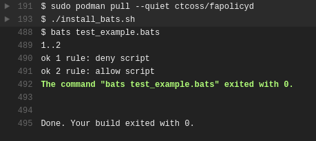

fapolicyd integration testing
===

fanotify in a container

- fapolicyd
- Travis CI
- Podman
- Bats

---

---

### reference
- https://github.com/jw3/example-podman-travis
- https://github.com/junaruga/podman-experiment
- https://clouding.io/kb/en/how-to-install-and-use-podman-on-ubuntu-18-04/
- https://github.com/ctc-oss/fapolicyd-container
